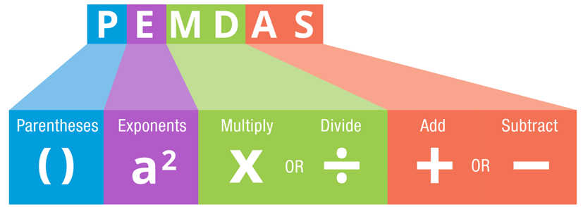
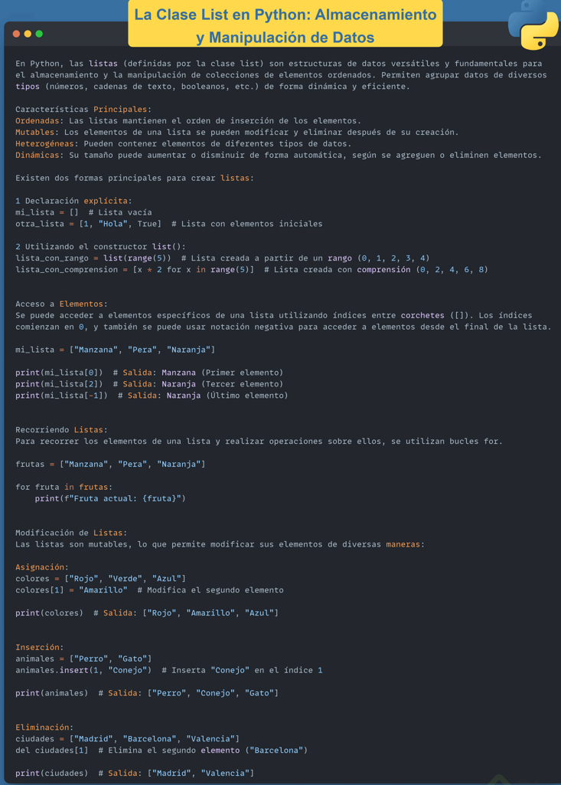
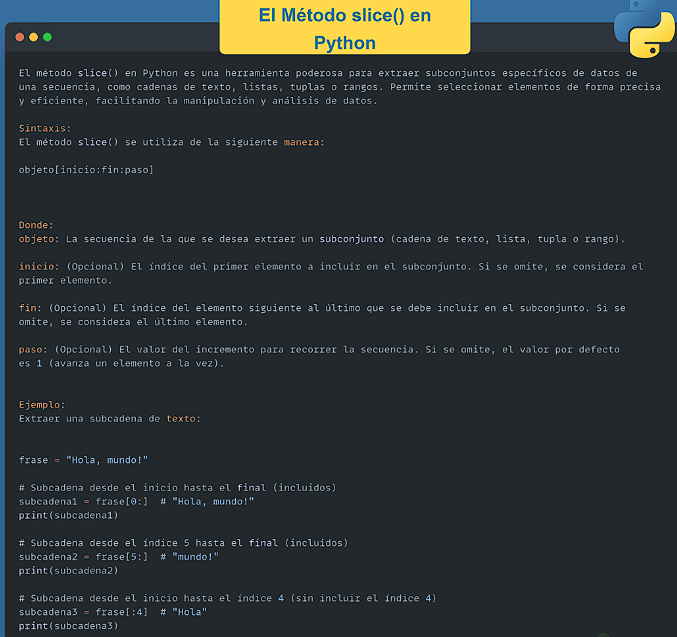

# Fundamendos de programación y Python

## ¿Porqué aprender python?

## Introducción a python

## Conceptos básicos de programación

## Práctica: te doy bienvenida a los ejercicios interactivos

## Manipulación de cadenas de texto en python

## Enteros, flotantes y booleanos

## Todo lo que debes saber sobre **print en python**

La función incorporada `print` puede parecer básico al principio, pero ten en cuenta que será una herramienta que usarás de múltiples maneras a lo largo de tu código. Desde el icónico “Hola mundo” hasta mensajes de depuración y presentación de resultados, `print` es la puerta de entrada a la comunicación de tus programas con el mundo exterior.

Iniciar con un simple “Hola mundo” no solo es una tradición en la programación, sino también un momento crucial donde tu código cobra vida. Es la primera línea de código que demuestra que tu entorno de desarrollo está configurado correctamente y que estás listo para empezar a crear.

Aprenderás a aprovechar al máximo la función incorporada `print` en Python. Desde formatos avanzados hasta el manejo de caracteres especiales y secuencias de escape, descubrirás cómo `print` puede ser una herramienta poderosa y versátil en tu caja de herramientas de programación.

### 1. Uso básico de `print`

El uso más sencillo de `print` consiste en pasar el texto que deseas mostrar entre comillas. Este código imprimirá “Nunca pares de aprender” en la consola, siendo una excelente forma de probar si tu entorno de Python está configurado correctamente.

```python
print("Nunca pares de aprender")

```

Resultado:

```
Nunca pares de aprender

```

### 2. Uso de la coma en `print`

La coma dentro de la función `print` se usa para separar varios argumentos. Al hacerlo, Python añade automáticamente un espacio entre los argumentos. Esto es diferente a concatenar cadenas con el operador `+`, que no añade espacios adicionales.

```python
print("Nunca", "pares", "de", "aprender")

```

Resultado:

```
Nunca pares de aprender

```

Por otro lado, al concatenar cadenas con el operador `+`, los elementos se unen sin ningún espacio adicional, a menos que lo añadas explícitamente.

```python
print("Nunca" + "pares" + "de" + "aprender")

```

Resultado:

```
Nuncaparesdeaprender

```

Para añadir un espacio explícitamente cuando concatenas cadenas, debes incluirlo dentro de las comillas.

```python
print("Nunca" + " " + "pares" + " " + "de" + " " + "aprender")

```

Resultado:

```
Nunca pares de aprender

```

### 3. Uso de `sep`

El parámetro `sep` permite especificar cómo separar los elementos al imprimir. En este ejemplo, los elementos “Nunca”, “pares”, “de” y “aprender” se imprimirán con una coma y un espacio entre ellos, resultando en “Nunca, pares, de, aprender”. Puedes cambiar `sep` por cualquier cadena de caracteres que desees usar como separador.

```python
print("Nunca", "pares", "de", "aprender", sep=", ")

```

Resultado:

```
Nunca, pares, de, aprender

```

### 4. Uso de `end`

El parámetro `end` cambia lo que se imprime al final de la llamada a `print`. En lugar de imprimir cada mensaje en una nueva línea, `end=""` asegura que “Nunca” y “pares” se impriman en la misma línea, resultando en “Nunca pares”. Por defecto, `end` es un salto de línea (`"\\n"`), lo que hace que cada llamada a `print` comience en una nueva línea.

```python
print("Nunca", end=" ")
print("pares de aprender")

```

Resultado:

```
Nunca pares de aprender

```

### 5. Impresión de variables

Puedes usar `print` para mostrar el valor de las variables. En este ejemplo, imprimirá “Frase: Nunca pares de aprender” y “Autor: Platzi”. Esto es útil para depurar y ver los valores de las variables en diferentes puntos de tu programa.

```python
frase = "Nunca pares de aprender"
author = "Platzi"
print("Frase:", frase, "Autor:", author)

```

Resultado:

```makefile
Frase: Nunca pares de aprender Autor: Platzi

```

### 6. Uso de formato con f-strings

Las f-strings permiten insertar expresiones dentro de cadenas de texto. Al anteponer una `f` a la cadena de texto, puedes incluir variables directamente dentro de las llaves `{}`. En este ejemplo, `frase` y `author` se insertarán en la cadena, resultando en “Frase: Nunca pares de aprender, Autor: Platzi”. Esto hace que el código sea más legible y fácil de escribir.

```python
frase = "Nunca pares de aprender"
author = "Platzi"
print(f"Frase: {frase}, Autor: {author}")

```

Resultado:

```yaml
Frase: Nunca pares de aprender, Autor: Platzi

```

### 7. Uso de formato con `format`

El método `format` es otra forma de insertar valores en cadenas de texto. Usando `{}` como marcadores de posición, puedes pasar los valores que quieres insertar como argumentos de `format`. En este ejemplo, se imprimirá “Frase: Nunca pares de aprender, Autor: Platzi”. Es una forma flexible y poderosa de formatear cadenas, aunque las f-strings son más concisas.

```python
frase = "Nunca pares de aprender"
author = "Platzi"
print("Frase: {}, Autor: {}".format(frase, author))

```

Resultado:

```yaml
Frase: Nunca pares de aprender, Autor: Platzi

```

### 8. Impresión con formato específico

Puedes controlar el formato de los números al imprimir. En este ejemplo, `:.2f` indica que el número debe mostrarse con dos decimales. Así, imprimirá “Valor: 3.14”, redondeando el número a dos decimales. Esto es especialmente útil cuando trabajas con datos numéricos y necesitas un formato específico.

```python
valor = 3.14159
print("Valor: {:.2f}".format(valor))

```

Resultado:

```makefile
Valor: 3.14

```

### 9. Saltos de línea y caracteres especiales

Los saltos de línea en Python se indican con la secuencia de escape `\\n`. Por ejemplo, para imprimir “Hola\nmundo”, que aparecerá en dos líneas:

```python
print("Hola\\nmundo")

```

Resultado:

```
Hola
mundo

```

Para imprimir una cadena que contenga comillas simples o dobles dentro de ellas, debes usar secuencias de escape para evitar confusiones con la sintaxis de Python. Por ejemplo, para imprimir la frase “Hola soy ‘Carli’”:

```python
print('Hola soy \\'Carli\\'')

```

Resultado:

```arduino
Hola soy 'Carli'

```

Si necesitas imprimir una ruta de archivo en Windows, que incluya barras invertidas, también necesitarás usar secuencias de escape para evitar que Python interprete las barras invertidas como parte de secuencias de escape. Por ejemplo:

```python
print("La ruta de archivo es: C:\\\\Users\\\\Usuario\\\\Desktop\\\\archivo.txt")

```

Resultado:

```mathematica
La ruta de archivo es: C:\\Users\\Usuario\\Desktop\\archivo.txt

```

En Python, estas secuencias de escape te permiten manejar caracteres especiales y estructurar la salida de texto según sea necesario, asegurando que la salida se formatee correctamente en la consola o en cualquier otro medio donde se imprima.

Con estos ejemplos y explicaciones adicionales, tendrás una comprensión más completa sobre cómo manejar saltos de línea y caracteres especiales en Python al usar la función `print`.

## Operaciones matemáticas en python



# Colección y procesamiento de datos en python

## Listas



## Método slice



## Listas de más dimensiones y tuplas

Las matrices en Python son una herramienta poderosa que permite organizar datos en listas de listas, facilitando su manejo y manipulación.

### ¿Qué es una matriz en Python?

Una matriz es una colección ordenada de datos dispuestos en filas y columnas. Se representa como una lista de listas, donde cada sublista es una fila de la matriz.

### ¿Cómo iterar a través de una matriz?

Para iterar a través de una matriz en Python, se puede utilizar un bucle for anidado. Cada sublista (fila) se recorre individualmente:

* **Ejemplo de matriz:**

```python
matrix = [
    [1, 2, 3],
    [4, 5, 6],
    [7, 8, 9]
]
```

* **Iterar e imprimir cada elemento:**

```python
for row in matrix:
    for element in row:
        print(element)
```

### ¿Cómo acceder a elementos específicos en una matriz?

Para acceder a un elemento específico en una matriz, se utilizan los índices de la fila y la columna. Por ejemplo, para acceder al número 9 en la matriz anterior, se usa `matrix[2][2]`.

* **Código:**

```python
print(matrix[2][2])  # Salida: 9
```

### ¿Qué significa que las matrices sean mutables?

Las matrices son mutables, lo que significa que se pueden modificar, añadir o eliminar elementos después de su creación. Este es un ejemplo básico:

* **Modificar un elemento:**

```python
matrix[0][0] = 10
print(matrix)  # Salida: [[10, 2, 3], [4, 5, 6], [7, 8, 9]]
```

### ¿Cuál es la diferencia entre matrices y tuplas?

A diferencia de las matrices, las tuplas son inmutables, lo que significa que no se pueden modificar después de su creación. Las tuplas se utilizan para almacenar datos que no deben cambiar.

* **Ejemplo de tupla:**

```python
numbers = (1, 2, 3)
```

Intentar modificar una tupla genera un error:

```python
numbers[0] = 10  # Genera TypeError: 'tuple' object does not support item assignment
```

## Aplicación de matrices

### Aplicación de Matrices

Las matrices son una herramienta fundamental en muchas áreas de la computación y las matemáticas. En Python, podemos usar listas dentro de listas para representar matrices bidimensionales (2D). Hoy, vamos a explorar varias aplicaciones prácticas de las matrices y cómo estas estructuras pueden ser usadas para representar tableros de juego.

#### Representación de Tableros de Juego

Las matrices son ideales para representar tableros de juego en programación, como tableros de ajedrez, damas y otros juegos de mesa. Usar matrices para estos fines permite manejar fácilmente la disposición de las piezas y las reglas del juego.

##### Ejemplo: Tablero de Ajedrez

Un tablero de ajedrez es una matriz de 8x8. En vez de representar solo las casillas blancas y negras, podemos representar las piezas de ajedrez. Usaremos letras para representar las piezas: P para peón, R para torre, N para caballo (knight), B para alfil, Q para reina y K para rey. Las piezas negras se representan con letras minúsculas y las blancas con letras mayúsculas.

```python
chess_board = [
    ['r', 'n', 'b', 'q', 'k', 'b', 'n', 'r'],
    ['p', 'p', 'p', 'p', 'p', 'p', 'p', 'p'],
    [0, 0, 0, 0, 0, 0, 0, 0],
    [0, 0, 0, 0, 0, 0, 0, 0],
    [0, 0, 0, 0, 0, 0, 0, 0],
    [0, 0, 0, 0, 0, 0, 0, 0],
    ['P', 'P', 'P', 'P', 'P', 'P', 'P', 'P'],
    ['R', 'N', 'B', 'Q', 'K', 'B', 'N', 'R']
]print(chess_board)
```

En este ejemplo, el 0 representa una casilla vacía.

##### Movimiento de un Caballo

En ajedrez, los caballos (N para blanco y n para negro) se mueven en forma de “L”. Esto significa que pueden moverse dos casillas en una dirección y luego una casilla perpendicularmente, o una casilla en una dirección y luego dos casillas perpendicularmente.

Por ejemplo, si el caballo blanco está en la posición (7, 1) (segunda casilla de la última fila), las posiciones posibles a las que puede moverse son:

(5, 0)
(5, 2)
(6, 3)
Es importante verificar que estas posiciones estén dentro de los límites del tablero y no contengan piezas blancas.

Si movemos el caballo de (7, 1) a (5, 2), el tablero se vería así:

```python
chess_board[7][1] = 0  # Casilla original del caballo ahora está vacía
chess_board[5][2] = 'N'  # Nueva posición del caballo

print(chess_board)
```

##### Ejemplo: Tablero de Damas

Un tablero de damas también es una matriz de 8x8, pero además de las casillas alternas, debemos representar las piezas de los dos jugadores.

```python
checkers_board = [
    [0, 'b', 0, 'b', 0, 'b', 0, 'b'],
    ['b', 0, 'b', 0, 'b', 0, 'b', 0],
    [0, 'b', 0, 'b', 0, 'b', 0, 'b'],
    [0, 0, 0, 0, 0, 0, 0, 0],
    [0, 0, 0, 0, 0, 0, 0, 0],
    ['w', 0, 'w', 0, 'w', 0, 'w', 0],
    [0, 'w', 0, 'w', 0, 'w', 0, 'w'],
    ['w', 0, 'w', 0, 'w', 0, 'w', 0]
]
print(checkers_board)
```

En este ejemplo, el 0 representa una casilla vacía, 'w' representa una pieza blanca, y 'b' representa una pieza negra. Las filas superiores e inferiores están llenas de piezas en sus posiciones iniciales, mientras que las filas centrales están vacías.

#### Aplicación de Matrices a Imágenes

Las matrices también son esenciales para la representación y manipulación de imágenes. Cada píxel de una imagen en escala de grises se puede representar como un valor en una matriz, donde cada valor varía del 0 (negro) al 255 (blanco).

##### Ejemplo: Representación de una Imagen en Escala de Grises

Imaginemos una matriz de 5x5 que representa una imagen en escala de grises con un simple patrón.

```python
image = [
    [255, 0, 0, 0, 255],
    [0, 255, 0, 255, 0],
    [0, 0, 255, 0, 0],
    [0, 255, 0, 255, 0],
    [255, 0, 0, 0, 255]
]
print(image)
```

En esta matriz, el 255 representa píxeles blancos y el 0 representa píxeles negros. Este patrón podría visualizarse como una “X” blanca sobre un fondo negro si se dibujara.

### Aplicaciones en Otros Campos

Las matrices se utilizan en muchos otros campos además de los juegos y las imágenes. Aquí hay algunos ejemplos:

* Análisis de Datos: Las matrices se utilizan para almacenar y manipular grandes conjuntos de datos, realizar cálculos estadísticos y análisis de datos.
* Inteligencia Artificial y Machine Learning: Las matrices son esenciales para representar datos de entrada y salida, pesos de redes neuronales y otros parámetros en algoritmos de aprendizaje automático.
* Computación Científica: Las matrices se utilizan para resolver ecuaciones lineales, realizar simulaciones y modelar fenómenos científicos.
* Gráficos por Computadora: Las matrices se utilizan para representar y transformar objetos en gráficos 2D y 3D.

***Las matrices son una herramienta poderosa que no solo facilita la representación de datos complejos, sino que también permite realizar operaciones y transformaciones avanzadas de manera eficiente. Al dominar el uso de matrices en Python, puedes abrir la puerta a un mundo de posibilidades en diversos campos de la ciencia, la ingeniería y la tecnología.***

## Diccionarios

Los diccionarios en Python son una estructura que almacenan dos datos, la clave y el valor. Un ejemplo cotidiano es un diccionario físico donde buscamos el significado de una palabra y encontramos la palabra (clave) y su definición (valor). Veamos cómo se utilizan en código.

### ¿Cómo se crea un diccionario en Python?

Iniciamos creando una variable llamada `numbers` y especificamos el uso de diccionarios utilizando llaves. Asignamos valores a las claves:

```python
numbers = {1: "one", "2": "two", 3: "three"}
print(numbers)
```

### ¿Cómo se accede a los elementos de un diccionario?

Para consultar la información de una clave específica, utilizamos la indexación:

```python
print(numbers["2"])
```

### ¿Cómo se eliminan elementos de un diccionario?

Para eliminar un elemento, utilizamos la clave del mismo:

```python
del information["edad"]
print(information)
```

### ¿Qué métodos existen para trabajar con diccionarios?

Podemos utilizar métodos propios de los diccionarios, como `keys()`, `values()`, e `items()`:

```python
# Obtener las claves
claves = information.keys()
print(claves)

# Obtener los valores
valores = information.values()
print(valores)

# Obtener los pares clave-valor
pares = information.items()
print(pares)
```

### ¿Cómo se crea un diccionario de diccionarios?

Podemos crear una agenda de contactos usando diccionarios de diccionarios:

```python
contactos = {
    "Carla": {"apellido": "Florida", "altura": 1.7, "edad": 30},
    "Diego": {"apellido": "Antesana", "altura": 1.75, "edad": 32}
}
print(contactos["Carla"])
```

# Control de flujo en python


## Estructuras condicionales


En programación, las estructuras condicionales son esenciales para tomar decisiones basadas en ciertas condiciones. Por ejemplo, al usar la instrucción `IF` en Python, se puede verificar si una variable cumple con una condición específica y ejecutar el código correspondiente.

### ¿Cómo se usa la estructura IF en Python?

Para utilizar el `IF`, primero se define una variable, por ejemplo, `x = 10`. Luego, se escribe la estructura condicional usando la palabra reservada `IF` seguida de la condición, como `if x > 5:`. Si esta condición es verdadera, se ejecuta el código dentro del `IF`, que debe estar indentado.

```python
x = 10
if x > 5:
    print("x es mayor que 5")
```

### ¿Qué pasa si la condición del IF es falsa?

Si la condición del `IF` no se cumple, se puede utilizar la instrucción `else` para manejar el caso contrario. Por ejemplo, si `x` es menor o igual a 5, se ejecutará el bloque de código dentro del `else`.

```python
x = 3
if x > 5:
    print("x es mayor que 5")
else:
    print("x es menor o igual a 5")
```

### ¿Cómo se manejan múltiples condiciones?

Cuando hay múltiples condiciones, se puede usar `elif` (else if). Esto permite agregar condiciones adicionales entre `if` y `else`.

```python
x = 5
if x > 5:
    print("x es mayor que 5")
elif x == 5:
    print("x es igual a 5")
else:
    print("x es menor que 5")
```

### ¿Cómo se manejan múltiples condiciones en un solo IF?

Para evaluar múltiples condiciones en una sola sentencia `IF`, se pueden utilizar los operadores lógicos `and` y `or`. El operador `and` requiere que ambas condiciones sean verdaderas, mientras que el operador `or` requiere que al menos una condición sea verdadera.

```python
x = 15
y = 30
if x > 10 and y > 25:
    print("x es mayor que 10 y y es mayor que 25")
if x > 10 or y > 35:
    print("x es mayor que 10 o y es mayor que 35")
```

### ¿Qué es la negación en las condiciones?

La palabra reservada `not` se utiliza para negar una condición. Si una condición es verdadera, `not` la convierte en falsa, y viceversa.

```python
x = 15
if not x > 20:
    print("x no es mayor que 20")
```

### ¿Cómo se anidan las estructuras IF?

Los `IF` anidados permiten evaluar condiciones dentro de otras condiciones. Esto es útil para verificar múltiples niveles de requisitos.

```python
isMember = True
age = 15
if isMember:
    if age >= 15:
        print("Tienes acceso ya que eres miembro y mayor que 15")
    else:
        print("No tienes acceso ya que eres miembro, pero menor a 15 años")
else:
    print("No eres miembro y no tienes acceso")
```


## Bucles y control de iteraciones

## Generadores e iteradores

# Funciones y manejo de excepciones en python

## Uso de funciones en python

## Funciones Lambda y Programación funcional en python

## Manejo de excepciones en python y uso de pass

## ¿Cómo realizar una función recursiva en python?

# Programación orientada a objetos en python

## Fundamentos de programación orientada a objetos en python

## Ejercicio biblioteca con POO

## Herencia en POO con python

## Objetos heredados

## Los 4 pilares de la programación orientada a objetos

## Superando los Fundamentos de programación orientada a objetos

## Proyecto final: guerra naval
